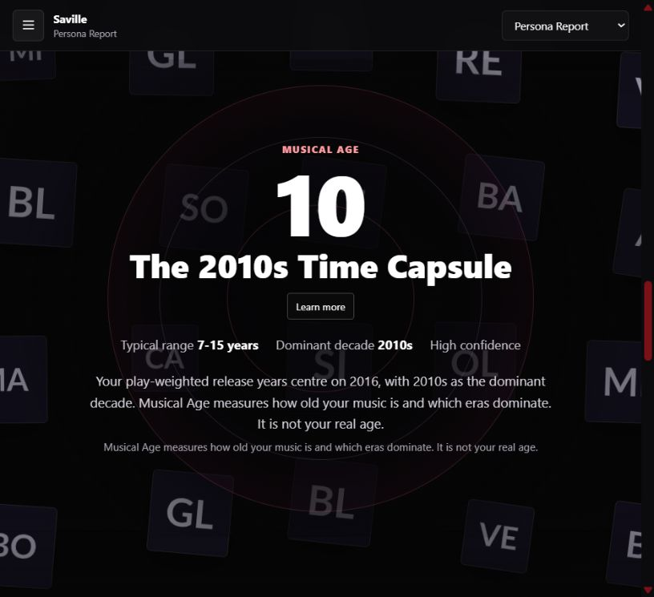
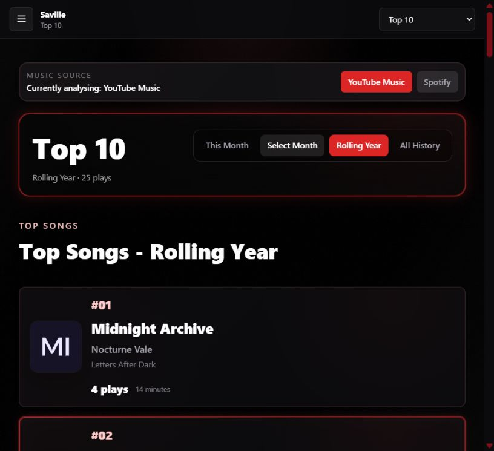
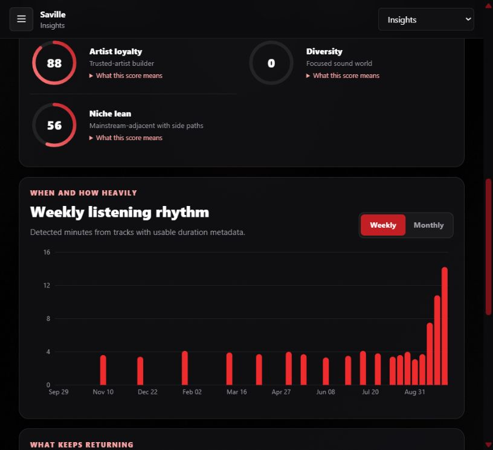
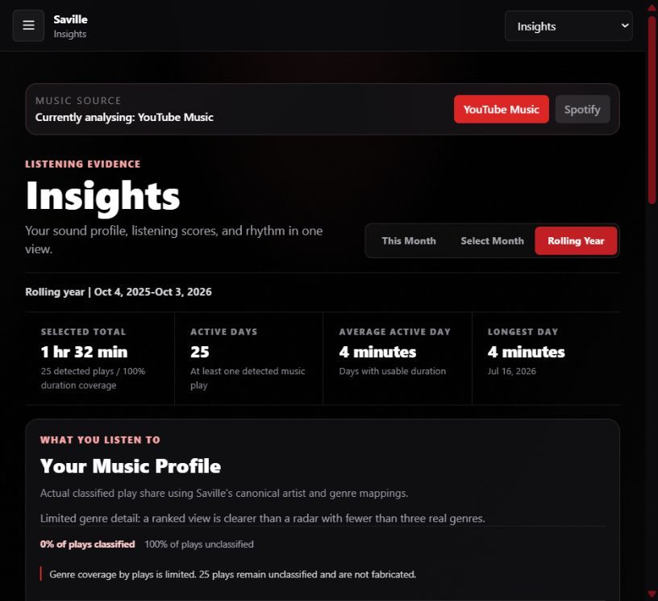
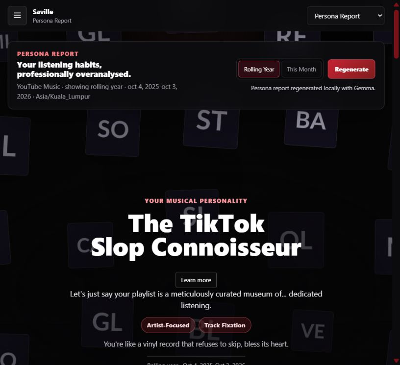
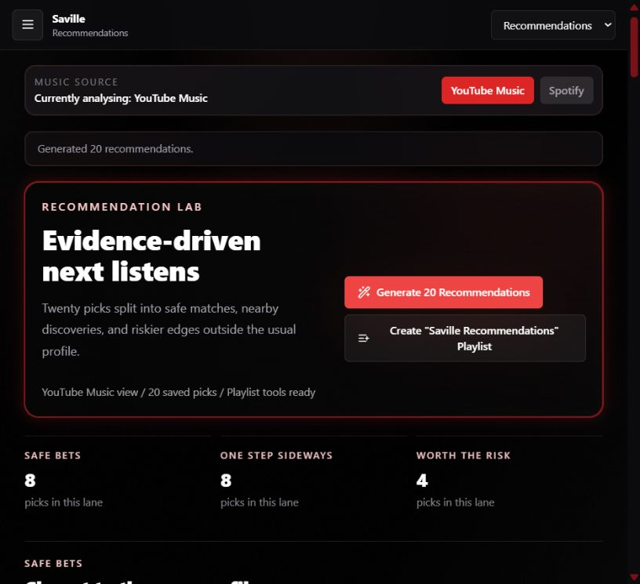
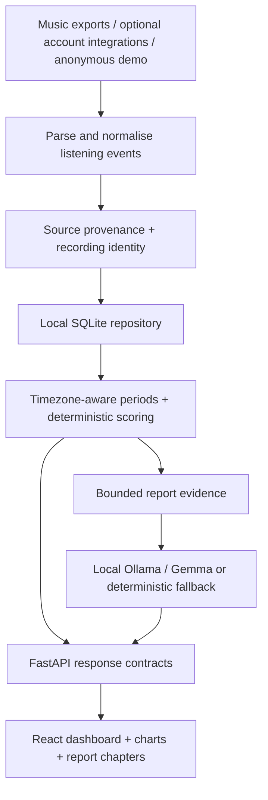

# Saville Music Persona

### A listening history can tell a story.

**A personal project by Chan Zhi Hong · Electrical Engineering, Universiti Malaya**

Saville turns music listening records into a dashboard of recurring favourites, listening rhythms, and a playful personality report. The engineering challenge is making that story traceable to the underlying data: repeated plays, messy imports, missing metadata, and changing date ranges.

**React + TypeScript · FastAPI + Python · SQLite · Ollama / Gemma 3**

*Actual app capture using fictional demo artists and tracks. Musical Age describes the age of the music, not the listener.*

This repository is the public project presentation: screenshots, architecture, and a tested walkthrough. Application source remains in the [development repository](https://github.com/aidanchan0623/Saville-Music-Persona). There is no hosted application in this repository.

[Visual walkthrough](#01--from-records-to-ranked-favourites) · [Architecture](#how-it-works) · [Technical details](docs/technical-walkthrough.md) · [Test report](docs/testing.md)

---

## 01 / From records to ranked favourites

The Top 10 view makes the basics inspectable: song, artist, play count, detected minutes, and the selected period. A rolling year and a calendar month answer different questions, so the period travels with the result.

The import pipeline preserves repeated listening events while removing overlapping copies of the same source occurrence. Recording identity also distinguishes versions such as live performances and remixes. This prevents a polished dashboard from hiding a counting problem.

## 02 / Show the evidence behind the profile

Insights brings together repeat attachment, discovery, artist loyalty, listening rhythm, and period leaders. Weekly and monthly views make it easier to see how the same listening history changes over time.

Coverage is part of the interface. Detected minutes are derived from available track durations; they are not stopwatch measurements of time spent listening. Missing genre mappings remain unclassified rather than becoming invented statistics.

See the coverage view

The synthetic artists used here do not have canonical genre mappings. This example deliberately exposes the resulting gap: 0% classified genre coverage, despite usable duration metadata.

## 03 / Give the data a voice

The Persona Report presents five chapters: musical personality, listening world, musical age, top artists and songs, and a closing roast. Animated artwork provides atmosphere while the text and figures remain readable.

The analytics services calculate the facts. A local **Gemma 3 4B** model writes bounded prose around those facts, with schema validation and a deterministic fallback if generation is unavailable or rejected. The model does not choose the numeric rankings or Musical Age.

## 04 / Make discovery explainable

Recommendations are grouped into **safe bets**, **one step sideways**, and **worth the risk**. Each candidate includes a fit score and a reason, with caution when genre evidence is limited.

The demo produced **20 recommendations: 8 safe, 8 adjacent, and 4 exploratory**. These are fictional candidates for demonstrating the workflow; this is not a recommendation-quality benchmark. Account playlist creation was not exercised.

---

## How it works

| Layer | Tools | Responsibility |
|---|---|---|
| Interface | React, TypeScript, Vite, Tailwind, Recharts | Period selection, rankings, coverage, and charts |
| Report presentation | Motion, GSAP, Three.js / OGL | Scroll-based chapters and decorative artwork |
| Backend | Python, FastAPI, Pydantic | Imports, jobs, validated API responses |
| Data | SQLite, canonical events, metadata caches | Reproducible calculations and source separation |
| Optional language | Ollama, `gemma3:4b` | Local report prose with validated fallbacks |

The local application supports YouTube Music and a separate optional Spotify profile. Public screenshots use the built-in anonymous dataset. Private listening exports and credentials are not included here.

## Tested on 3 October 2026

| Check | Result |
|---|---|
| Backend automated suite, after local corrections | **225 passed** |
| Frontend import tests | **6 passed** |
| Production frontend build | **Passed** |
| Demo loading, period changes, rankings, rhythm controls | **Verified in the browser** |
| Local Gemma report regeneration | **Succeeded** |
| Anonymous recommendation generation | **20 picks generated** |
| Historical HTML Takeout import | **Verified locally; personal data kept private** |
| Optional catalogue enrichment | **Completed a bounded batch with saved progress** |

The backend results describe the locally corrected checkout. Those corrections have **not** been pushed to the development repository. See the [test report](docs/testing.md) for the changes, remaining limitations, and untested integrations.

## What I am taking from this project

A convincing interface needs a reliable chain from input to explanation. Saville brings together data handling, backend contracts, frontend interaction, and local language generation—and makes the gaps in the evidence visible.

I’m happy to exchange ideas about music analytics, local AI, and building interfaces that explain their results.

**Chan Zhi Hong** · [GitHub](https://github.com/aidanchan0623)
