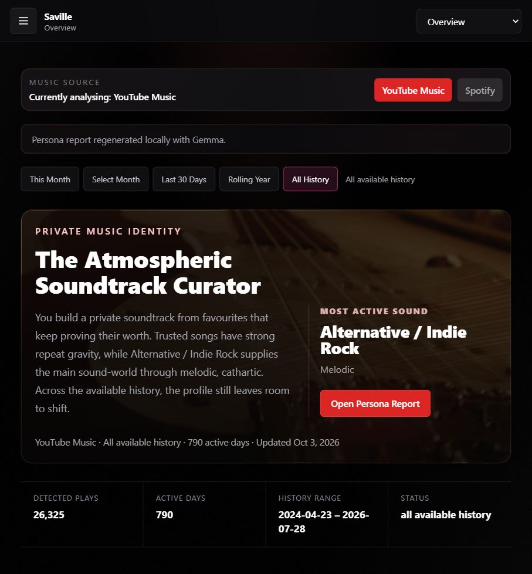
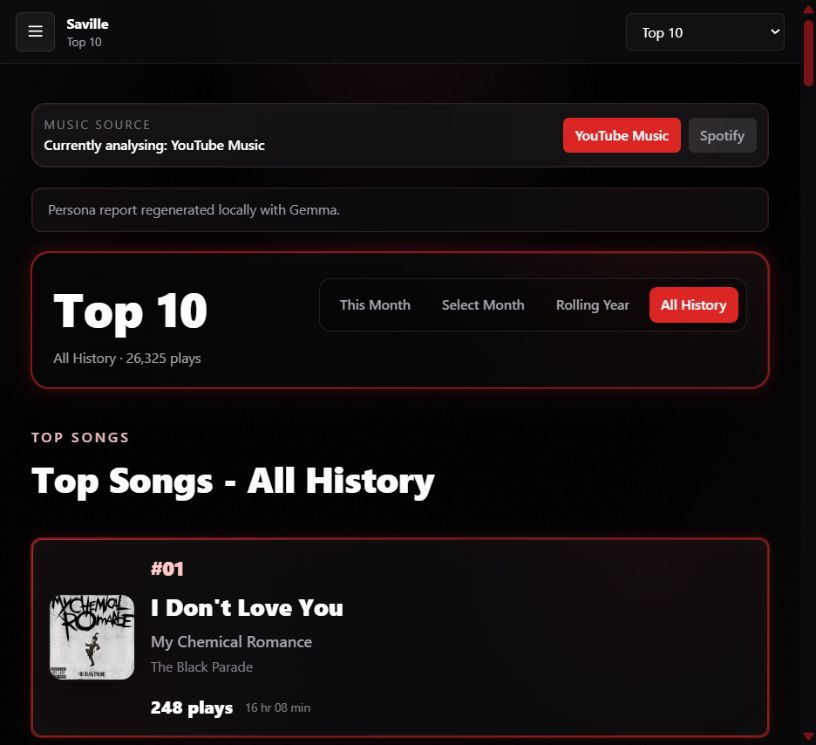
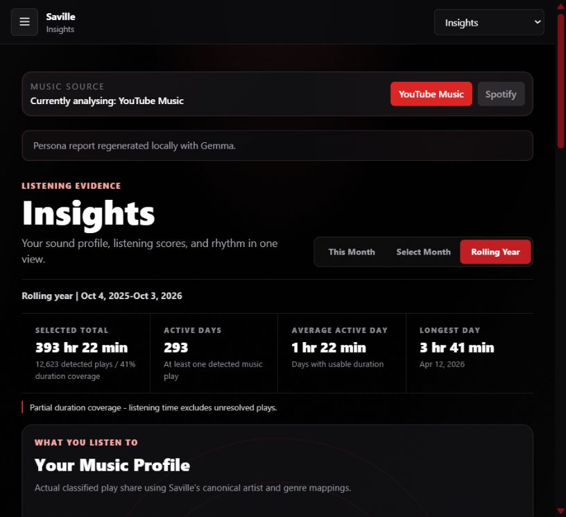
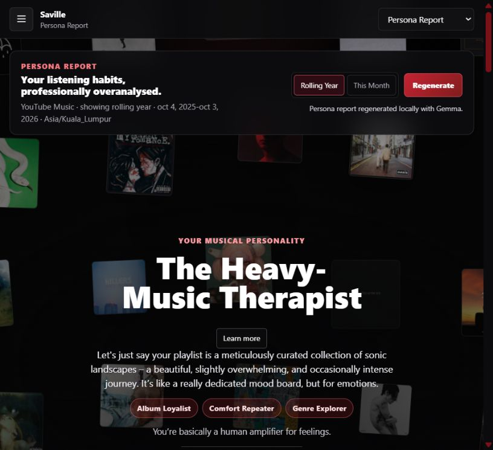
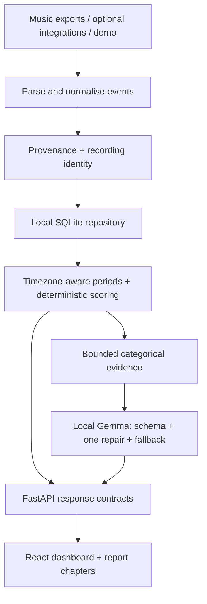

# Saville Music Persona

### A listening history can tell a story.

**A personal project by Chan Zhi Hong · Electrical Engineering, Universiti Malaya**

I built Saville to explore the patterns behind my music: the songs I return to, the artists that stay with me, and how those habits change over time. It brings together a listening dashboard, explainable analytics and a playful report written locally with Gemma.

**React + TypeScript · FastAPI + Python · SQLite · Ollama / Gemma 3**

*Actual application screenshot. My export covers 23 April 2024–28 July 2026; it does not establish my listening after July.*

This is the public presentation repository. [Application source and setup](https://github.com/aidanchan0623/Saville-Music-Persona) are maintained separately. There is no hosted app here.

[Walkthrough](#01--find-the-favourites) · [Try the sample](demo/README.md) · [Technical details](docs/technical-walkthrough.md) · [Tests](docs/testing.md) · [Gemma investigation](docs/gemma-reliability.md)

---

## The project in one snapshot

| Evidence from my historical import | Result |
|---|---|
| Ranked music plays | **26,325** |
| Active listening days | **790** |
| Canonical recording groups | **4,144** |
| Leading artist | **My Chemical Romance · 1,465 plays** |
| Leading song | **I Don't Love You · 248 plays** |
| Genre / duration / release-year coverage | **70.6% / 45.9% / 58.4%** |

These are aggregate counts from my imported profile, published with my approval. Missing metadata remains visible; detected minutes estimate full track lengths for covered plays, rather than measuring actual listening time.

## 01 / Find the favourites

Top 10 makes each ranking inspectable: song, artist, plays, detected minutes and the selected period. Repeated listening events are preserved; overlapping copies of the same occurrence are removed. Live, acoustic and remix versions keep distinct recording identities.

**Engineering focus:** preserving real repetition without inflating counts through duplicate imports.

## 02 / Explain the pattern

Insights connects repeat attachment, discovery, artist loyalty and listening rhythm. The same timezone-aware period profile feeds the dashboard and the report, so changing a period changes the underlying evidence consistently.

**Engineering focus:** showing where metadata supports an interpretation—and where it is incomplete.

## 03 / Give the evidence a voice

The Persona Report walks through musical personality, listening world, musical age, favourite artists and songs, and a closing roast. Analytics calculate the facts. **Gemma 3 4B runs locally through Ollama** to write the prose.

This regeneration completed in approximately **8.1 seconds** on this machine. Its response reports prompt version 11, Gemma generation and no fallback reason. That is an observed run, not a latency or reliability benchmark.

I investigated an earlier validation failure and changed the generator to five named fields, a schema included in the prompt, temperature zero, and one bounded repair attempt. Musical Age stays deterministic. Invalid or unavailable model responses still have a labelled fallback. [Read the investigation and verification](docs/gemma-reliability.md).

**Engineering focus:** keeping model-written language separate from calculated evidence and making fallback behaviour visible.

## 04 / Explore beyond familiar songs

Recommendations group candidates into safe bets, one step sideways and worth the risk, with fit scores and reasons.

*This screenshot uses the earlier anonymous fixture: 20 fictional candidates in lanes of 8 / 8 / 4. It demonstrates the interface, not recommendation accuracy. Live playlist creation was not tested.*

---

## Try the data

- [Importable Takeout-style sample](demo/takeout-sample.json): **30 generated events across six real favourite songs**. All timestamps and repetitions are synthetic.
- [Listening summary](demo/listening-summary.json): approved aggregate rankings and metadata coverage from my full historical import.
- [Persona report](demo/persona-report.json): the actual rolling-year report shown above, including generation provenance and period boundaries.
- [Instructions and provenance](demo/README.md): how to import the small sample without confusing its counts with the full-history screenshots.

The screenshots and aggregates include my music preferences. The raw Takeout ZIP, individual real listening timestamps, credentials and local database are not published here.

## How it works

| Layer | Tools | Responsibility |
|---|---|---|
| Interface | React, TypeScript, Vite, Tailwind, Recharts | Period controls, rankings, coverage and charts |
| Presentation | Motion, GSAP, Three.js / OGL | Scroll chapters and decorative artwork |
| Backend | Python, FastAPI, Pydantic | Imports, bounded jobs and API contracts |
| Data | SQLite, canonical events, metadata caches | Reproducible analysis and source separation |
| Language | Ollama, `gemma3:4b` | Validated local prose around fixed facts |

## Verified on 3 October 2026

| Check | Result |
|---|---|
| Full backend suite | **229 passed** |
| Frontend tests | **6 passed** |
| Production frontend build | **Passed** |
| Real-history import, rankings and period views | **Verified** |
| Gemma: roast, serious and playful modes | **Valid live responses in all three modes** |
| Browser regeneration with the imported profile | **Gemma success; no fallback** |
| Demo fixture | **30 parsed music events; six recording IDs** |

The fixes are published in the development repository. [Testing details and limits](docs/testing.md) distinguish automated checks, real-profile verification and the earlier fictional walkthrough.

## What I am taking from this project

A convincing interface needs a reliable chain from input to explanation. Saville has given me practice in data handling, backend contracts, frontend interaction and local language generation—and in making the gaps in the evidence visible.

I’m happy to exchange ideas about music analytics, local AI and interfaces that explain their results.

**Chan Zhi Hong** · [GitHub](https://github.com/aidanchan0623)
